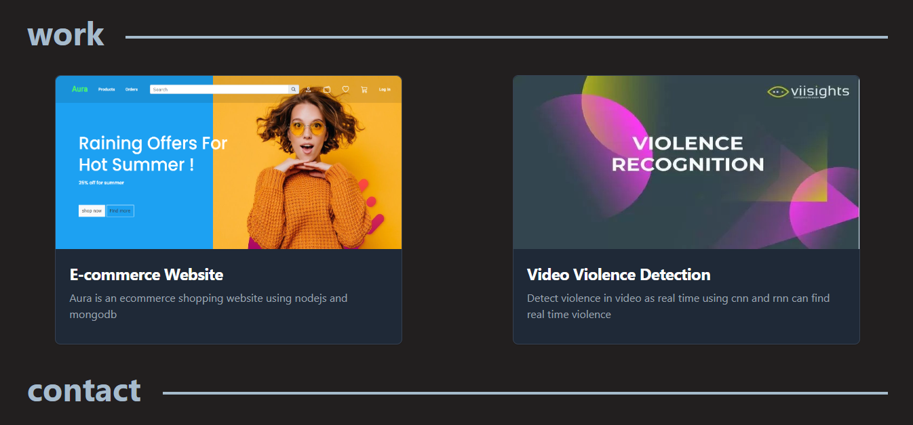
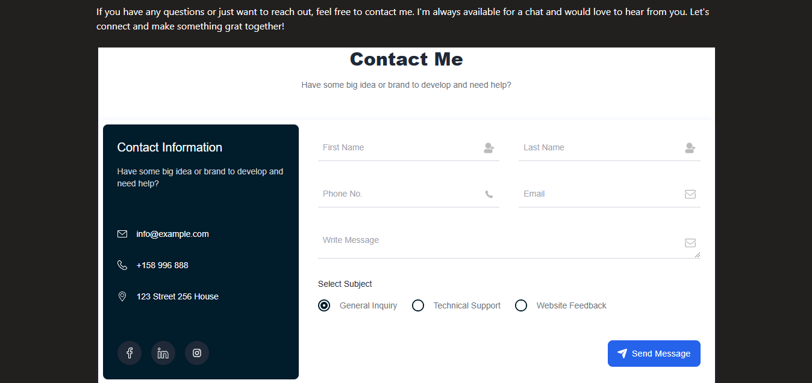

# Portfolio React + Vite

A simple portfolio using react

## Demo
https://subinsb.netlify.app
## Images





## Mobile view


### 🔧 Built With

- [**React**](https://react.dev/): A powerful library for building UI components.
- [**Vite**](https://vitejs.dev/): A blazing fast frontend build tool, making the development process a breeze.
- [**Tailwind CSS**](https://tailwindcss.com/): A utility-first CSS framework for rapidly building modern user 


### 🛠️ Local Setup

You can set up this project locally by following these steps:

```
git clone https://github.com/Subin-sb1/Portfolio-react.git
cd portfolio-react
npm install
npm start
```
